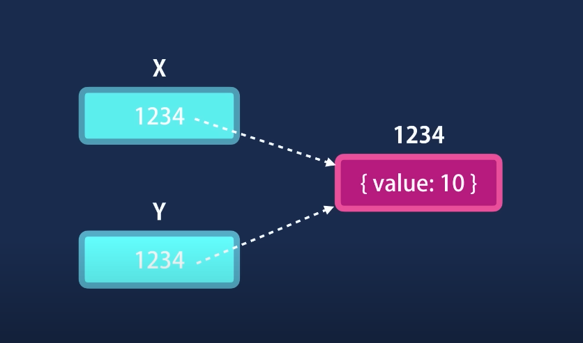

# Value and Reference Types

## Value Types
* number
* string
* boolean
* symbol
* undefined
* null

## Reference Types
* object
* function
* array

 

### Primitives are copied by their value

 

### Objects copied by their reference