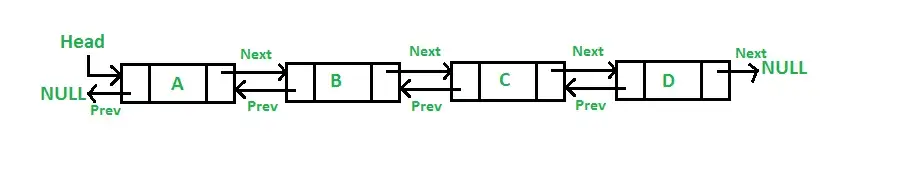

# Doubly linked list

## What is a Doubly Linked List?
A Doubly Linked List is very similar to a Singly Linked List; it is a data structure that consists of nodes. The list will have a head, tail, and length value. Unlike arrays, Linked Lists do not have indexes pointing to each node, so the only way to search or access data would be to traverse through the list.

<br>

### **null <- 0 -> <- 0 -> <- 0 -> <- 0 -> <- 0 -> null**
The one difference between a Doubly Linked List and a Singly Linked List is that each node in a Doubly Linked List has pointers to both the next and previous values compared to nodes in a Singly Linked List which only have a pointer to the next value. To set up a Doubly Linked List class, it will be exactly the same as a Singly Linked List. The code below sets up a class for Nodes and a class for the Doubly Linked List.



<br>

```
class Node {
  constructor(val) {
    this.val = val;
    this.prev = null;
    this.next = null;
  }
}
class DoublyLinkedList {
  constructor() {
    this.head = null;
    this.tail = null;
    this.length = 0;
  }
}
```

<br>

## Adding Methods to the Doubly Linked List
We will now add methods to our Doubly Linked List class. In this article, we will handle the basic methods for push, pop, shift, and unshift. It is similar to building a Singly Linked List class, except we need to keep in mind that each node has both a next and a previous value.

<br>

## Push (Adding a node to the end)
The push method will take a value as an argument and we will first create a new node with that value, which we are saving here as newNode. There is one edge case that we need to check for which is if the list is empty. We can do this by checking if there is no head, or if the length is equal to 0. If so, then we will simply set the head and the tail of the list to the new node. If the list is not empty, we will set the next property on the current tail to the new node, set the previous property on the new node to be the current tail, and set the tail property of the list to be the new node. Finally, we will increase the length of the list by one and return the list.

<br>

## Pop (Removing a node from the end)
In the pop method, we will have two edge cases. First, if the list is empty, we return undefined. Second, if the length of the list is equal to 1, we will remove that node, so we will set the head and tail properties of the list to null. In other cases, we first need to store the current tail in a temporary variable so we do not lose the reference to it. Then, we will set the tail of the list to be equal to the previous node of the current tail. Next, we then need to sever the ties between the new tail and the old tail. This is done by setting the next of the new tail to be null and setting the previous of the old tail (stored as temp) to be null. Finally, we will decrease the length by 1 and return the old tail.

<br>

## Shift (Removing a node from the beginning)
For a Doubly Linked List, the shift method is very similar to the pop method, except we will be working with the head, rather than the tail. We will again, first check for the two edge cases for length being equal to 0 and equal to 1 and do the exact same thing. Otherwise, we will store the current head in a temporary variable, then set the new head of the list to be the next value of the old head. Then we will sever the ties between the old and new head by setting the previous value of the new head to be null, and setting the next value of the old head (stored as temp) to be null. Finally, we will decrease the length of the list by 1 and return the old head.

<br>

## Unshift (Adding a node to the beginning)
Just like shift was similar to pop, unshift is similar to push, except we will be working with the head rather than the tail. The unshift method takes one argument, and we will create a new node with that value. We will first check for the edge case of an empty list. If so, we will set the head and the tail properties of the list to be the new node. Otherwise, we will set the next value of the new node to be the old head, set the previous value of the old head to be the new node, and set the head of the list to be the new node. Finally, we increase the length by 1 and return the list.

<br>

## Two-way Traversal
Having a Doubly Linked List can come in handy if you need to traverse the list from the head or the tail. It makes it a lot easier to navigate the list compared to a Singly Linked List which can only be traversed starting from the head.

<br>

## Memory
A Singly Linked List will require less memory for storage because each node only has a pointer in one direction. In a Doubly Linked List, each node also has a previous pointer, so it will take up more memory.

<br>