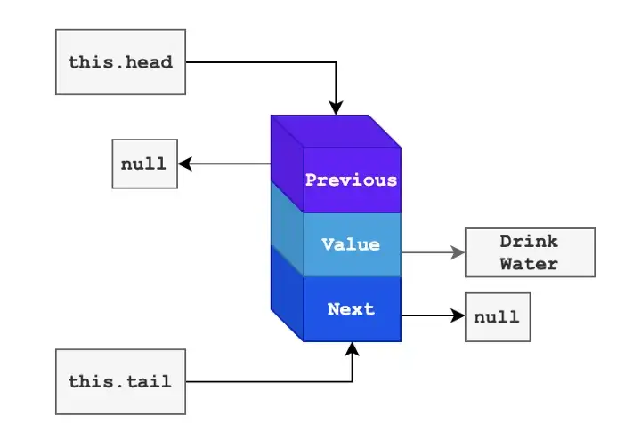
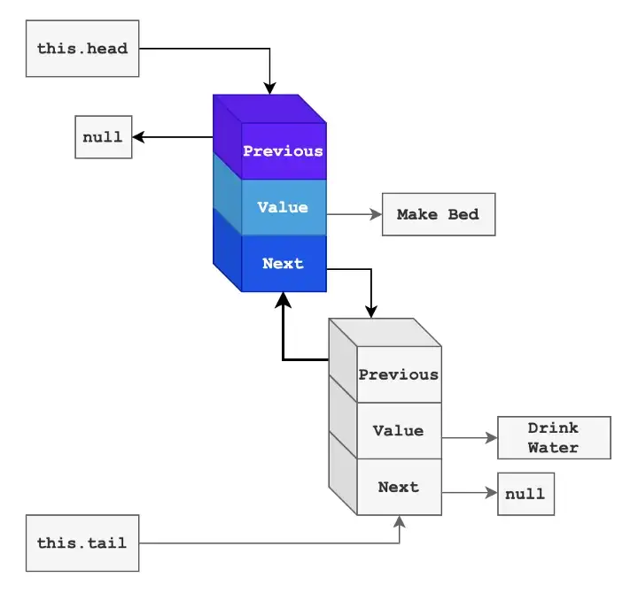
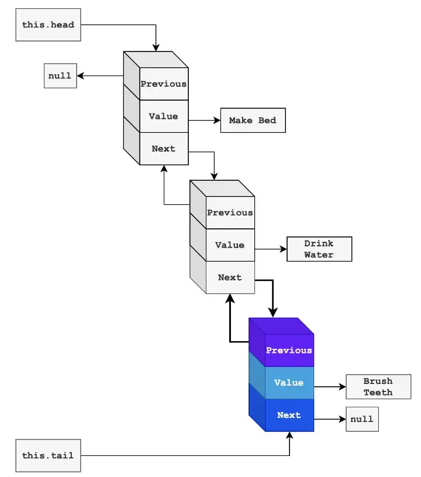
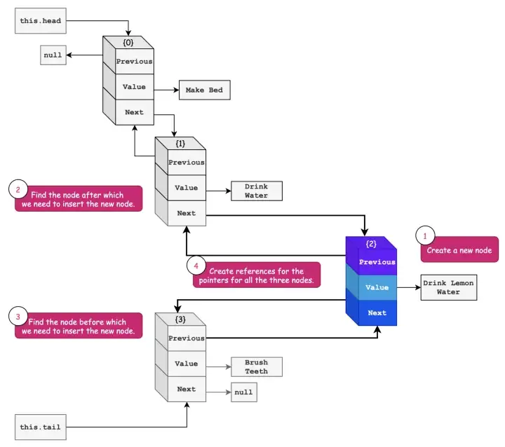
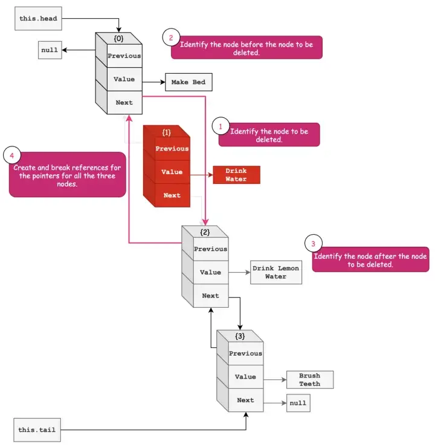

## Basic Operations
This is a list of the most common operations performed on Doubly Linked Lists. We will see the usage and their time complexities.

Let us get started with the node representation for the doubly linked list. I will consider a list of some morning habits.

<br>



<center>*First Node in Doubly Linked List | Morning Habits*</center>  

&nbsp;

We know a node in the doubly linked list consists of three elements — value, a previous pointer and the next pointer to the previous or next node respectively or null. The first node is called the head and the last node is called the tail. To begin let us consider we have only one node in our doubly linked list.

The node definition is as follows. The pointers are represented using this.next and this.previous for each node.

```
class Node {
    constructor(value) {
        this.value = value;  
        this.previous = null; 
        this.next = null;
    }
}
```

&nbsp;

Code representation for our first node will look as follows. Currently both head and tail are pointing to the first node.

```
const morningRoutine = {
    value: 'Drink Water',
    previous: null,
    next: null
};
```

&nbsp;

Now let us start with different operations on this linked list.

&nbsp;

## Prepend
Prepend means adding a node at the start of the linked list.

Let us add a morning routine Make Bed before Drink Water.

`prepend('Make Bed');`

<br>

### The steps will be to:
---

* Create a new node Make Bed. The previous and next pointers will be pointing to null for now.
* The this.head will point to the new node.
* No change for this.tail. It will point to the current node that is Drink Water.
* The pointer next for the new node will point to the node Drink Water.
* The pointer previous for the node Drink Water will point to the new node.



*<center>Prepend Node `Make Bed`</center>*

&nbsp;

This operation is straightforward. The time complexity is O(1) because we will only change the reference for this.head and the pointer previous for the new node.

Our linked list will be represented as follows.

```
const morningRoutine = {
    value: 'Make Bed',
    previous: null,
    next: {
        value: 'Drink Water',
        previous: `<REFERENCE TO NODE MAKE BED>`,
        next: null
    }
};
```
&nbsp;

## Append
Append means adding a node at the end of the linked list.

Let us add a new routine Brush Teeth after we had water in the morning.

`append('Brush Teeth');`

### The steps will be to:
---

* Create a new node Brush Teeth.
* The this.tail will point to the new node.
* The pointer next for the node Drink Water will point to the new node Brush Teeth.
* The pointer previous of the new node will point to the previous node * Drink Water.



&nbsp;

*<center>Append Node `Brush Teeth`</center>*

&nbsp;


This is the straightforward operation where we change the reference for this.tail, previous, and next for the nodes. The time complexity for this operation is O(1).

Now the morning routine linked list looks as follows.

```
const morningRoutine = {
    value: 'Make Bed',
    previous: null,
    next: {
        value: 'Drink Water',
        previous: `<REFERENCE TO NODE MAKE BED>`,
        next: {
            value: 'Brush Teeth',
            previous: `<REFERENCE TO NODE DRINK WATER>`,
            next: null
        }
    }
};
```

&nbsp;

## Insert
In this operation, we insert a node at a given index.

Let us add a new node Drink Lemon Water after I had some water that is the node Drink Water.

insert('Drink Lemon Water', 2);

### The steps will be to:
---

* Create a new node Drink Lemon Water.
* Traverse to the index 2 and keep the reference for the node Drink Water and Brush Teeth.
* Point next of the Drink Water node to the new node.
* Point previous of the new node back to the node Drink Water.
* Point next of the new node to the node Brush Teeth.
* Point previous of the node Brush Teethto the new node.




*<center>Insert `Drink Lemon Water` after `Drink Water`</center>*

&nbsp;

In the worst case, we might have to traverse to the end of the doubly linked list. Hence, the time complexity of this operation is O(N), where N is the number of nodes in the doubly linked list or the length of the doubly linked list.

Now the morning routine linked list looks as follows.

```
const morningRoutine = {
    value: 'Make Bed',
    previous: null,
    next: {
        value: 'Drink Water',
        previous: `<REFERENCE TO NODE MAKE BED>`,
        next: {
            value: 'Drink Lemon Water',
            previous: `<REFERENCE TO NODE DRINK WATER>`,
            next: {
                value: 'Brush Teeth',
                previous: `<REFERENCE TO NODE DRINK LEMON WATER>`,
                next: null
            }
        }
    }
};
```

&nbsp;

We can optimize the insert by checking the index — If the index is 0 call prepend, and when the index is equal to the length of the doubly linked list call append.

## Remove
In this operation, we delete a node at a given index.

Let us delete the node Drink Water.

delete('Drink Water', 1);

### The steps will be to:

* Traverse to the node that is before the node to be deleted — previousNode.
* Identify the node after the node to be deleted — nextNode.
* Point the next pointer of the node previousNode to the nextNode node.
* Point the previous pointer of the node previousNode to the previousNode.



*<center>Deleting the node `Drink Water` from the Doubly Linked List.</center>*

&nbsp;

The time complexity is O(N) as we need to through the linked list to find the node to be deleted.

With this, we will have the following linked list for the morning routine.

```
const morningRoutine = {
    value: 'Make Bed',
    previous: null,
    next: {
        value: 'Drink Lemon Water',
        previous: `<REFERENCE TO NODE MAKE BED>`,
        next: {
            value: 'Brush Teeth',
            previous: `<REFERENCE TO NODE DRINK LEMON WATER>`,
            next: null
        }
    }
};
```

&nbsp;

For optimization in the case of index being 0 we can point this.head to the next node.
