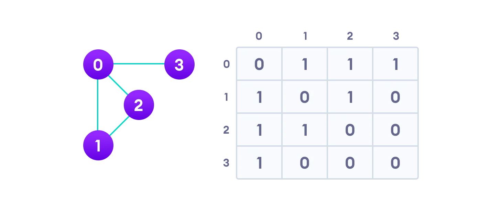
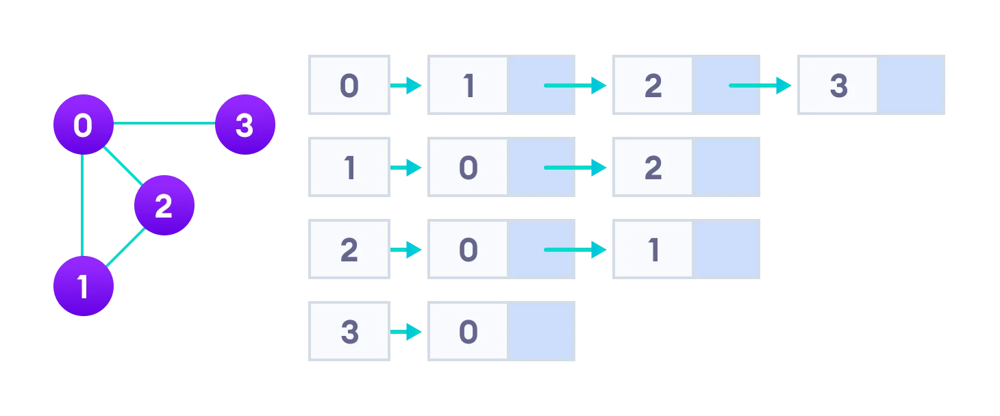
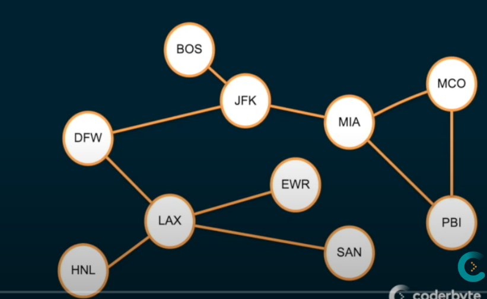

# Graph

Graphs are similar to trees. In fact, a tree is a graph that follows certain rules. As you move into more flexible data structures, you will need to cover more potential outcomes. This is why you learned linked lists (a type of tree) before you learned trees, and why you learned trees (a type of graph) before learning graphs. Simply put, a graph is a collection of nodes or **vertices** and edges. You already know what a node or **vertex** is, but what's an edge? An **edge** is a connection between two nodes.

Graphs are great for representing real world things. A graph can easily represent a wireless network with multiple access points, like a mesh router system. A graph can represent a social network, 'person a' is friends with 'person b' and 'person c', but not with 'person d', etc. A neighborhood can be represented by a graph. Each house is a node, the streets are the edges. A forest, cities on a map, locations of commercial aircraft, board games. There's almost no limit to what a graph can represent.

<br>

### A graph is a data structure (V, E) that consists of

* A collection of vertices V
* A collection of edges E, represented as ordered pairs of vertices (u,v)
  
<br>


```
V = {0, 1, 2, 3}
E = {(0,1), (0,2), (0,3), (1,2)}
G = {V, E}
```
### Graph Terminology
* Adjacency: A vertex is said to be adjacent to another vertex if there is an edge connecting them. Vertices 2 and 3 are not adjacent because there is no edge between them.
  
* Path: A sequence of edges that allows you to go from vertex A to vertex B is called a path. 0-1, 1-2 and 0-2 are paths from vertex 0 to vertex 2.


* Directed Graph: A graph in which an edge (u,v) doesn't necessarily mean that there is an edge (v, u) as well. The edges in such a graph are represented by arrows to show the direction of the edge.

### Graph Representation
Graphs are commonly represented in two ways:

1. Adjacency Matrix
An adjacency matrix is a 2D array of V x V vertices. Each row and column represent a vertex.

If the value of any element a[i][j] is 1, it represents that there is an edge connecting vertex i and vertex j.

The adjacency matrix for the graph we created above is:



<br>

Since it is an undirected graph, for edge (0,2), we also need to mark edge (2,0); making the adjacency matrix symmetric about the diagonal.

Edge lookup(checking if an edge exists between vertex A and vertex B) is extremely fast in adjacency matrix representation but we have to reserve space for every possible link between all vertices(V x V), so it requires more space.

### Adjacency List
An adjacency list represents a graph as an array of linked lists.

The index of the array represents a vertex and each element in its linked list represents the other vertices that form an edge with the vertex.

The adjacency list for the graph we made in the first example is as follows:



An adjacency list is efficient in terms of storage because we only need to store the values for the edges. For a graph with millions of vertices, this can mean a lot of saved space.

<br>

### Graph Operations
The most common graph operations are:

* Check if the element is present in the graph
* Graph Traversal
* Add elements(vertex, edges) to graph
* Finding the path from one vertex to another

<br>


## Breadth first traversal
* Traverses broad into the data structure by visiting neighbor nodes before children nodes

* Uses a queue data structure


### Code example


<br>

## Depth first traversal


<br>


 
[Graph Video (17 m)](https://www.youtube.com/watch?v=gXgEDyodOJU)  
[Graph Article](https://www.programiz.com/dsa/graph)

Here's a video on breadth first search and depth first search:
[BFS, DFS Video 15m](https://www.youtube.com/watch?v=TIbUeeksXcI)

Implement a basic graph [here](). 

Practice Problems:
  
[Leetcode Graph Problems](https://leetcode.com/tag/graph/)

