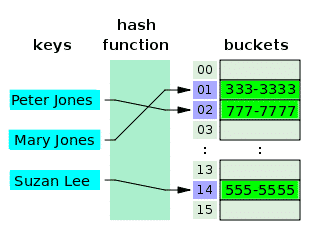
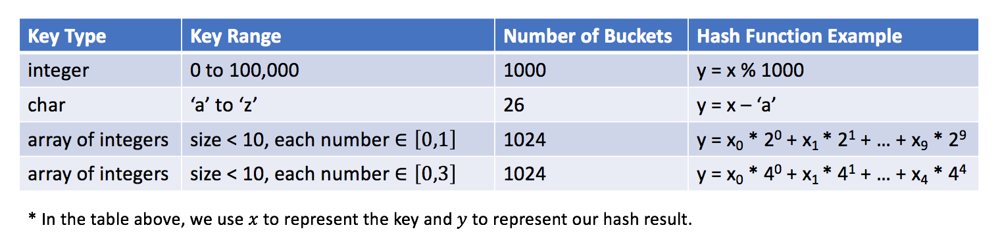

# Hash Table
Hash Table is a data structure which organizes data using hash functions in order to support quick insertion and search.

The __*hash map*__ is one of the implementations of a map data structure to store (key, value) pairs.
It is easy to use a hash table with the help of standard template libraries. Most common languages such as Java, C++ and Python support both hash set and hash map.

 

## The Principle of Hash Table

The Hash Table is a data structure which organizes data using hash functions in order to support __quick insertion and search__. In this article, we will take a look at the principle of the hash table.

 

The Principle of Hash Table
* The key idea of Hash Table is to use a hash function to __map keys to buckets__. To be more specific,

* When we insert a new key, the hash function will decide which bucket the key should be assigned and the key will be stored in the corresponding bucket;
When we want to search for a key, the hash table will use the same hash function to find the corresponding bucket and search only in the specific bucket.

 

In the example, we use `y = x % 5` as our hash function. Let's go through the insertion and search strategies using this example:

1. Insertion: we parse the keys through the hash function to map them into the corresponding bucket.
* e.g. 1987 is assigned to bucket 2 while 24 is assigned to bucket 4.

1. Search: we parse the keys through the same hash function and search only in the specific bucket.
* e.g. if we search for 1987, we will use the same hash function to map 1987 to 2. So we search in bucket 2 and we successfully find out 1987 in that bucket.
* e.g. if we search for 23, will map 23 to 3 and search in bucket 3. And We find out that 23 is not in bucket 3 which means 23 is not in the hash table.

 

## Keys to Design a Hash Table

There are two essential factors that you should pay attention to when you are going to design a hash table.

 

1. Hash Function
The hash function is the most important component of a hash table which is used to map the key to a specific bucket. In the example in the previous article, we use y = x % 5 as a hash function, where x is the key value and y is the index of the assigned bucket.

The hash function will depend on the range of key values and the number of buckets.

*Here are some examples of hash functions:*

 

It is an open problem to design a hash function. The idea is to try to assign the key to the bucket as **uniformly as you can**. Ideally, a perfect hash function will be a one-one mapping between the key and the bucket. However, in most cases, a hash function is not perfect and it is a tradeoff between **the amount of buckets** and **the capacity of a bucket**.

 

2. Collision Resolution
Ideally, if our hash function is a perfect one-one mapping, we will not need to handle collisions. Unfortunately, in most cases, collisions are almost **inevitable**. For instance, in our previous hash function `(y = x % 5)`, both 1987 and 2 are assigned to bucket 2. That is a *collision*.

A collision resolution algorithm should solve the following questions:

1. How to organize the values in the same bucket?
2. What if too many values are assigned to the same bucket?
3. How to search for a target value in a specific bucket?

These questions are related to *the capacity of the bucket* and *the number of keys* which might be mapped into *the same bucket* according to our hash function.

Let's assume that the bucket, which holds the maximum number of keys, has *N* keys.

Typically, if N is constant and small, we can simply use an *array* to store keys in the same bucket. If N is variable or large, we might need to use *height-balanced binary search tree instead*.

 

Exercise
By now, you should be able to implement a basic hash table. We provide the exercise for you to implement a hash set and a hash map. Read the requirement, determine your hash function and solve the collision if needed. 

If you are not familiar with the concepts of hash set and hash map, you can go back to the introduction part to find out the answer.

Insertion and search are two basic operations in a hash table.

Besides, there are operations that are based on these two operations. For example, when we remove an element, we will first search the element and then remove the element from the corresponding position if the element exists.

*Insertion* and *search* are two basic operations in a hash table.

Besides, there are operations that are based on these two operations. For example, when we *remove an element*, we will first search the element and then remove the element from the corresponding position if the element exists.

[Hash Table Video (19m)](https://www.youtube.com/watch?v=sfWyugl4JWA)  

[Article on Hash Tables]()

Make sure to implement resizing the hash table. 

More practice with problems that are suited to using a hash table is available [on Leetcode](https://leetcode.com/tag/hash-table/).

