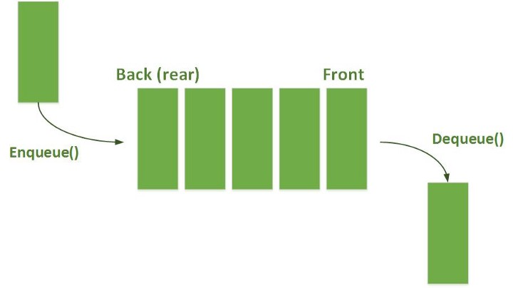

# Queue
## FIFO

A queue (pronounced like the letter "q") is like a line at the grocery store. The first person to get in line is the first person to check out. This is known as first in, first out.

 

# A queue has two main operations:

Insert a new element at the end of the queue, which is called enqueue.
Remove an element from the front of the queue, which is called dequeue.

 

## Time Complexity:
* Access: O(n)
* Search: O(n)
* Insert: O(1)
* Delete: O(1)

## Space Complexity:
* O(n)

 

Because a queue is so similar to a stack, see if you can implement it on your own [here](https://www.javascripttutorial.net/javascript-queue/) or a video [here](https://www.youtube.com/watch?v=iY0Ab5z5jY0)

Stacks and queues will be very useful when you get to working with trees and graphs. 

