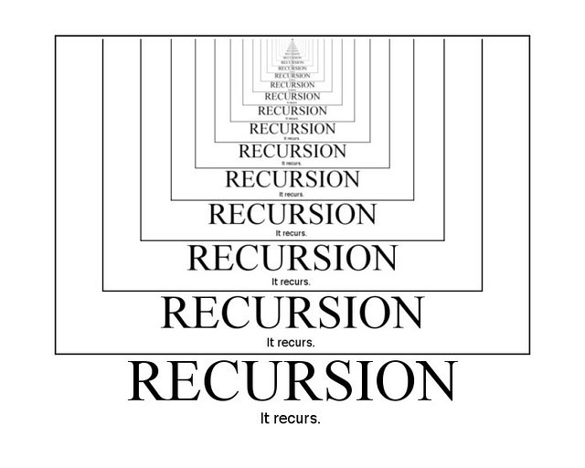

# Recursion

Recursion is when a function calls itself. 

You need to make sure you have a **base case**. The base case, or halting case, of a function is the problem that we know the answer to, that can be solved without any more recursive calls. The base case is what stops the recursion from continuing on forever. Every recursive function must have at least one base case (many functions have more than one). If it doesn't, your function will not work correctly most of the time, and will most likely cause your program to crash in many situations, definitely not a desired effect.


[Recursion Video](https://www.youtube.com/watch?v=6oDQaB2one8)

<br>



<br>

And now that you have a basic idea of recursion, you should practice a few different problems that use recursion.  
    [Fibonacci](https://leetcode.com/problems/fibonacci-number)  
    [Merge Two Sorted Lists](https://leetcode.com/problems/merge-two-sorted-lists)  
    [Power of Two](https://leetcode.com/problems/power-of-two)  
    [All Leetcode Recursion Problems](https://leetcode.com/tag/recursion/)  

## Note
Still struggling with recursion? Here's a tip. Any time you write a recursive function add a "spacing" parameter that is of type String. Give this parameter a default value of an empty string, "". Print the data you are working with at the beginning of the function, but make sure you put the spacing string at the front of the print statement. Before you call the function inside of itself, add two spaces to the spacing and pass that through. This way, as you move deeper and deeper into the recursive calls you will be able to track how deep you are, and what the state of the data is at that point.
```swift
func recursiveFunction(data: Int, spacing: String = "") {
    if data < 5 {
        print("\(spacing)\(data) Base case.")
        return
    }
    print("\(spacing)\(data)")
    recursiveFunction(data: data - 1, spacing: spacing + "      ")
    print("\(spacing)\(data) Other stuff happens.")
}

recursiveFunction(data: 10)
```

This will print the output below:  
```
10
      9
            8
                  7
                        6
                              5
                                    4 Base case.
                              5 Other stuff happens.
                        6 Other stuff happens.
                  7 Other stuff happens.
            8 Other stuff happens.
      9 Other stuff happens.
10 Other stuff happens.
```
If this isn't helpful, you can ask your mentor, hit me up directly (@Dan M on Slack), or ask in the general Slack channel. You can also just ignore it! 😉