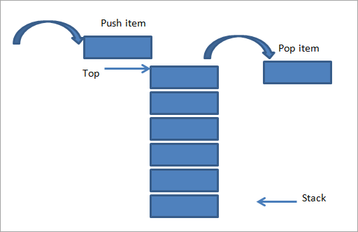

# Stack    
## LIFO

You can think of a stack like a stack of books or a stack of cards. You put (the technical term is **push**) things onto the stack. Then when you take them off (the technical term is **pop**), whatever you put on last will come off first. A stack is a last in, first out (LIFO) data structure.

Considered as a linear data structure, or more abstractly a sequential collection, the push and pop operations occur only at one end of the structure, referred to as the top of the stack. This data structure makes it possible to implement a stack as a singly linked list and as a pointer to the top element. A stack may be implemented to have a bounded capacity. If the stack is full and does not contain enough space to accept another element, the stack is in a state of stack overflow.

 

One of the best ways to ensure you actually understand a data structure is to implement it. Can you implement a stack? Your stack should be a class that has a push method and a pop method. It's ok if you need to refer back to the video or article.

[Stack Video](https://www.youtube.com/watch?v=wtynhUwS5hI)  

[Stack Article](https://en.wikipedia.org/wiki/Stack_(abstract_data_type))

