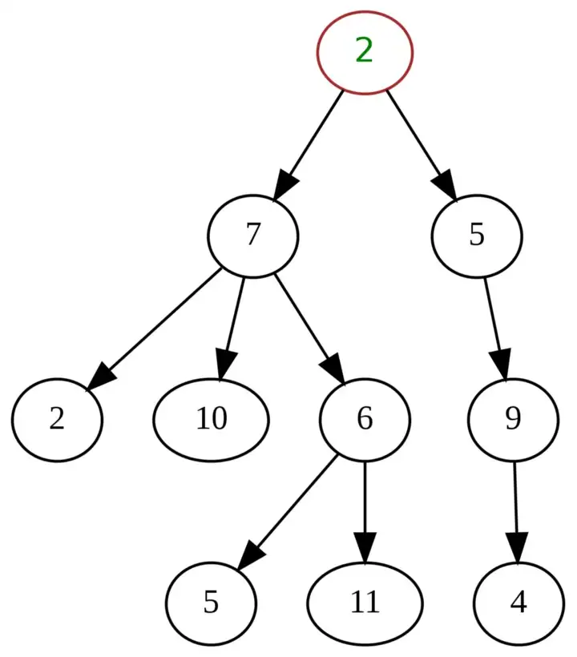
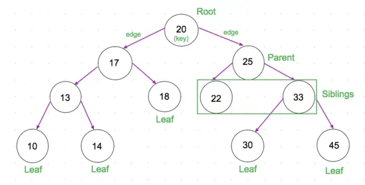

# Tree:
is a data structure that consists of nodes with a parent and child relationship. Every tree can have only one root node (which is the uppermost node). Each node can have any number of child nodes. Keep in mind however that each node can only have one parent node (except for the root node which will not have a parent node). In the image below, the node with a value of 2 is our root node. 2, then has two children, 7 and 5. 7, then has three children, 2, 10, and 6, etc.

 

 

## Binary Trees:
are a type of tree, where each node can have at most two child nodes. In the image below, you can see that each node has either 0, 1, or 2 child nodes.

Before moving forward with trees, I would suggest taking the time to either go through the [Recursion](https://github.com/morsedan/UDDTechnicalInterviewPrep/blob/main/Algorithms/Recursion.md) module, or at least familiarize yourself with the concept of recursion. 

Once you are familiar with the idea of recursion, take a look at the video or article on trees.

 

[Tree Video](https://www.youtube.com/watch?v=qYiBx2pomlQ)  
[Tree Article](https://en.wikipedia.org/wiki/Tree_(data_structure))

Test your understanding by implementing a basic binary search tree [here](https://github.com/morsedan/UDTechnicalInterviewPrep/blob/main/DataStructures/BinarySearchTree/BinarySearchTree/main.swift). Or [here](https://github.com/morsedan/UDTechnicalInterviewPrep/blob/main/DataStructures/BinarySearchTree/BinarySearchTree.py) if you use Python.

More practice is available at the following sites:
    - [Leetcode](https://leetcode.com/tag/tree/)
