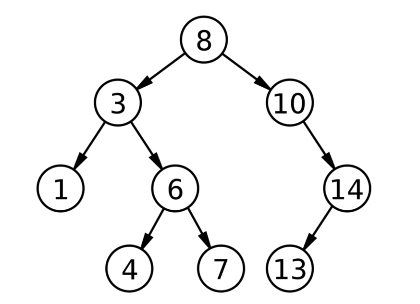

# Trees, Binary Trees, and Binary Search Trees

Tree is a data structure that consists of nodes with a parent and child relationship. Every tree can have only one root node (which is the uppermost node). Each node can have any number of child nodes. Keep in mind however that each node can only have one parent node (except for the root node which will not have a parent node). In the image below, the node with a value of 2 is our root node. 2 has two children, 7 and 5. 7 has three children: 2, 10, and 6, etc.

 

 

## Binary Trees:
are a type of tree where each node can have at most two child nodes. In the image below, you can see that each node has either 0, 1, or 2 child nodes.

 

## Binary Search Trees
Binary Search Trees are a type of Binary Tree that has sorted data. These can be useful for searching or insertion. The rule for Binary Search Trees is that for each parent node, every value on the left side must be less than the parent, and every value on the right side must be greater than the parent. In the image below, we can see that 8 (our root node) has two children, 3 and 10. On the left side, 3 is less than 8, and on the right side, 10 is greater than 8. We can then look at each node and do the same check going down the tree.

 

For Binary Search Trees, keep in mind that every value to the left must be less than the parent, and every value to the right must be greater than the parent. For example, in the image above, if we changed the node with a value of 7 to 9, this would not be a valid Binary Search Tree, because 9 would be greater than 8. Remember, every node value on the left side of 8 must be less than 8, and every node value on the right side must be greater than 8.

 

# Tree traversal
In computer science, tree traversal (also known as tree search and walking the tree) is a form of graph traversal and refers to the process of visiting (e.g. retrieving, updating, or deleting) each node in a tree data structure, exactly once. Such traversals are classified by the order in which the nodes are visited. The following algorithms are described for a binary tree, but they may be generalized to other trees as well.

 

## Breadth first search- BFS (level order traversal)
The algorithm efficiently visits and marks all the key nodes in a graph in an accurate breadthwise fashion. This algorithm selects a single node (initial or source point) in a graph and then visits all the nodes adjacent to the selected node. BFS accesses these nodes one by one.

Once the algorithm visits and marks the starting node, then it moves towards the nearest unvisited nodes and analyzes them. Once visited, all nodes are marked. These iterations continue until all the nodes of the graph have been successfully visited and marked.

1. In the various levels of the data, you can mark any node as the starting or initial node to begin traversing. The BFS will visit the node and mark it as visited and places it in the queue.
   
2. Now the BFS will visit the nearest and un-visited nodes and marks them. These values are also added to the queue. The queue works on the FIFO model.
   
3. In a similar manner, the remaining nearest and un-visited nodes on the graph are analyzed marked and added to the queue. These items are deleted from the queue as receive and printed as the result.

 

## Depth first traversal- DFS
DFS is an algorithm for finding or traversing graphs or trees in depth-ward direction. The execution of the algorithm begins at the root node and explores each branch before backtracking. It uses a stack data structure to remember, to get the subsequent vertex, and to start a search, whenever a dead-end appears in any iteration. The full form of DFS is Depth-first search.

 

### Preorder (DLR) dealer
root -> left -> right
data -> left -> right

### Ineorder (LDR) leader
left -> root -> right
left -> data -> right

### Postorder (LRD) lardo
left -> right -> root
left -> rigth -> data

 

## Breadth first traversal

 

## Depth first traversal

 

[Tree Video](https://www.youtube.com/watch?v=qYiBx2pomlQ)  

[Tree Article](https://en.wikipedia.org/wiki/Tree_(data_structure))

Test your understanding by implementing a basic binary search tree [here](https://javascript.plainenglish.io/tree-traversal-with-javascript-29b57d61d486). Or [here](https://www.youtube.com/watch?v=K7VnBuOlCI8)

More practice is available at the following sites:
    - [Leetcode](https://leetcode.com/tag/tree/)

